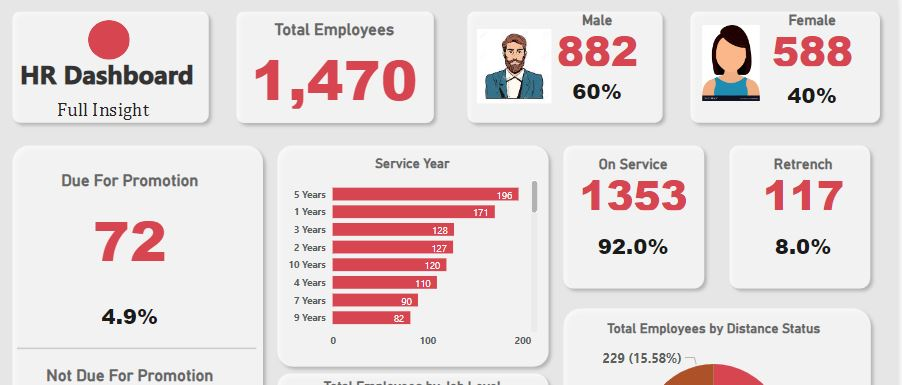

# Human-Resource-Analysis-Project
I  ampleased to present the Human Resource Analysis Report, a comprehensive tool meticulously designed to provide profound insights into the intricate dynamics of your organization's human resources data.

Human Resource Analysis Report

Introduction

We are pleased to present the Human Resource Analysis Report, a comprehensive tool meticulously designed to provide profound insights into the intricate dynamics of your organization's human resources data. In today's rapidly evolving business landscape, the ability to make informed HR decisions is paramount for enhancing workforce productivity, fostering employee engagement, and ultimately steering the organization towards unparalleled success. Our user-friendly HR Analysis Dashboard offers real-time access to critical HR metrics and analytics, empowering you to make well-informed, data-driven decisions that have a direct impact on recruitment, employee retention, and talent development. It's an indispensable asset for unlocking the full potential of your workforce and gaining a competitive edge in the meticulous management of your most valuable asset – your people.

Data Cleaning Process

Our approach to ensuring the integrity of the data involved a multi-step process, conducted with meticulous attention to detail and precision:

Data Splitting: The initial step involved splitting the data columns to address the issue of disorganization and inconsistency.

Header Standardization: We utilized the first row as the header for the dataset to provide a consistent and structured foundation for analysis.

Data Quality Assurance: We meticulously scrutinized the data to guarantee its cleanliness, accuracy, and adherence to a standardized format.

Promotion Eligibility Identification: Conditional columns were added to identify employees due for promotion and those who were not.

Measures Table: A dedicated measure table was created to house all relevant calculations and measures.

DAX Expressions: Complex DAX expressions were employed to address specific organizational queries and challenges.

HR Requirements and Key Insights

HR Requirements

Total Employee Count: The organization boasts a robust workforce of 1470 employees.

Gender Distribution: Of these employees, 882 are male, comprising 60% of the workforce, while 588 are female, accounting for 40%.

Promotion Eligibility: A meticulous analysis revealed that 72 employees are currently due for promotion, constituting 4.9% of the total workforce.

Non-Promotion Group: The remaining 1398 employees are presently not due for promotion, making up 95.1% of the workforce.

Continued Service: A significant majority of the workforce, precisely 1353 employees (92%), are expected to continue their service within the organization.

Retrenchment Candidates: A distinct subset of 117 employees, approximately 8% of the total workforce, have accumulated more than 18 years of service and merit consideration for potential retrenchment.

Performance Rating: Employees were categorically grouped based on their job performance into high-rated (84.63%) and low-rated (15.37%) categories.

Severance Benefits: Notably, the report identifies employees originally earmarked for promotion who unexpectedly appeared on a retrenchment list. This insight serves to prevent undue severance benefit costs.

Insights from the Analysis

These findings, derived from our meticulous analysis, empower your HR team and organizational management with invaluable information for decision-making and strategic planning. The HR Analysis Dashboard offers a profound understanding of your workforce, providing the framework for enhancing talent management and driving your organization's success. It is a vital tool for optimizing HR strategies and nurturing your most valuable asset – your workforce.
